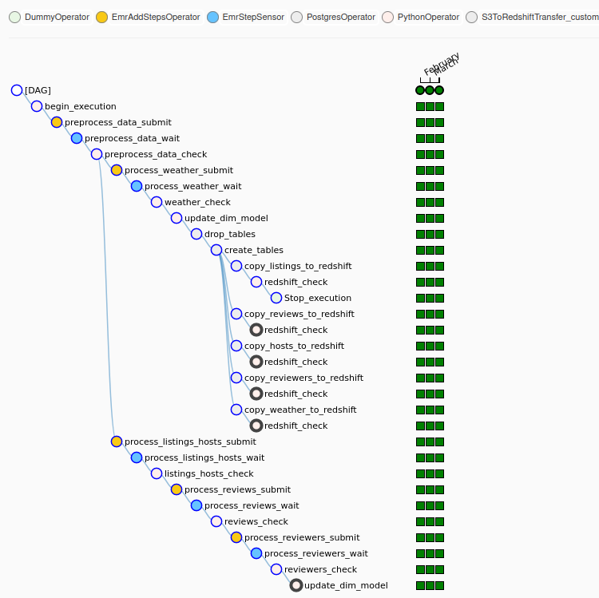

# Airbnb ETL pipeline: Spark on EMR, Redshift & Airflow 

Are there more positive or negative reviews of Airbnb stays? Are reviews more negative when weather is bad? Are all reviews in English? Are there hosts with listings in multiple cities? How many guests visited more than one city? ...

Goal of this project is to prepare data that can answer all the questions above and many more. Raw data from several sources are transformed using Apache Spark, enhanced by natural language processing algorithms and loaded into AWS Redshift database. Apache Airflow is used to schedule and monitor the pipeline execution.

This project is submitted as Capstone project of Udacity Data Engineer Nanodegree program.

## Table of contents

- [Dimensional model](#dimensional-model)
- [Source data](#source-data)
- [ETL pipeline](#etl-pipeline)
- [Exploring the data](#exploring-the-data)


## Dimensional model
To better understand the ETL pipeline, lets describe the final outcome of the pipeline first - the dimensional model that can be queried in Redshift.

The model holds data about Airbnb listings, including their name, location, description. It holds information about hosts offering stays. Hosts can have multiple listings. The model holds reviews of Airbnb stays. There are multiple reviews per reviewer and each listing can receive multiple reviews. The model also contains weather data, daily rain and temperature measurements. Reviews and weather data are available only for selected cities: Paris, London, Amsterdam and Berlin. 

The model comprises five tables: fact table *reviews* and dimensional tables *reviewers*, *listings*, *hosts* and *weather*.

[Data dictionary](/docs/data_dictionary.xlsx) provides descriptions of the data, it is mostly a copy from [Inside Airbnb's data dictionary](https://docs.google.com/spreadsheets/d/1iWCNJcSutYqpULSQHlNyGInUvHg2BoUGoNRIGa6Szc4/edit#gid=360684855) that comes with the source data.

Statistics (unique records):
- listings: 630731 records
- reviews: 3313766 records
- reviewers: 2788446 records
- hosts: 449889 records
- weather: 17888 records

Below is a summary of the most interesting columns:

|Reviews |Reviewers |Listings |Hosts | Weather|
|--|--|--|--|--|
|review_id	|			| 		|	 	| 		|	
|reviewer_id	|	reviewer_id	|  		|  		|  		|
|listing_id	|			|listing_id	|  		| 		|
|host_id	|			|host_id	| host_id	| 		|
|weather_id	|			|		| 		| weather_id	|
|--|--|--|--|--|
|date		|			|		| 		|date		|
|reviewer_name	|	reviewer_name	|		| 		| 		|
|		| 			|city		|		|city		|
|		| 			|last_scraped	|last_scraped	|		|
|--|--|--|--|--|
|sentiment	|	languages_spoken|first_review	|host_name	|temperature	|
|comment_language|			|longitude	|host_about	|rain		|
|comments	| 			|latitude	|host_location	|		|
|		| 			|name		|host_url	|		|
|		|	 		|picture_url	|host_picture_url|		|
|		| 			|price		|		|		|
|		| 			|property_type	|		|		|
|		| 			|room_type	|		|		|
|		| 			|license	|		|		|
|		| 			|listing_url	|		|		|
|		| 			|description	|		|		|


## Source data
There are 3 sources of data:
- Inside Airbnb's listings and reviews data, scraped monthly [Download here.](http://insideairbnb.com/get-the-data.htm)
	- period: January, February and March 2021
	- cities: Amsterdam, Paris, London, Berlin
	- format: csv
- Airbnb listings data downloaded from opendatasoft, it contains ~490k unique listings from several dozen cities globally. Format: csv. [Download here.](https://public.opendatasoft.com/explore/dataset/airbnb-listings)
- Weather data, daily mean temperature and daily rainfall from ecadu.eu. Format: txt. [Download here.](https://www.ecad.eu)

My usage of Inside Airbnb's data does not align perfectly with their mission, I can only say thank you and spread the word, check them out at [http://insideairbnb.com/](http://insideairbnb.com/)

Total size of the source data is 5.8 GB, total number of records ~14.7 million. However, many of the records are duplicates.

Use [get_original_data.ipynb](get_original_data.ipynb) to download the data.

## ETL pipeline

ETL comprises three parts
- Part I: preprocess raw data into parquet files
- Part II: create dimensional model using the preprocessed data
- Part III: create Redshift model and copy in the data

In Part I raw data stored in csv and txt files are read using Apache Spark and with minimal transformation saved into parquet files, columnar format more suitable for fast reads. Minimal transformations include dropping columns, removing multiline headers from txt files and extracting city name from filepath of the data.


In Part II Spark reads preprocessed parquet files and transforms them into the final dimensional model tables in csv format. Transformations performed include: joining tables using join and union operations, filtering using window functions, and dropping duplicates. Natural language processing models from Spark-NLP library is used for language detection of Airbnb reviews and sentiment analysis is performed on the english subset of the comments.


In Part III dimensional model is created in Redshift database and copy queries are run to load the csv data from Part II.


### Apache Airflow
The entire ETL is orchestrated by Apache Airflow.

Source data of Airbnb listings and reviews are available in packages updated every month. The ETL is scheduled to run every month, pickup data from folder labeled by relevant month and use it to create dimensional model either from scratch if none exists or update existing one. The source data include January, February and March 2021 data and are run with backfill.

The ETL is designed robustly and if new data in the same format are provided then it can continue updating the dimensional model *forever*.

Here are some of the most interesting features used:
- backfill - processing data in batches labeled by execution date
- custom operator
- parallel tasks
- EMR operator to add spark-submit steps to EMR
- EMR sensor
- Postgres operator for connection to Redshift


To run the Airflow ETL copy contents of [airflow](airflow) folder to $AIRFLOW_HOME. The folder contains .py with DAG definition and plugins folder with one custom operator.




### Spark on EMR
The ETL is executed automatically by Airflow, but it can also be run manually in jupyter notebooks, in both cases on EMR.

EMR cluster is created using AWS CLI command provided in [docs/aws_create_cluster.txt](docs/aws_create_cluster.txt), bootstrap file and spark configuration are in [config/emr-bootstrap.sh](config/emr-bootstrap.sh) and [config/spark-config.json](config/spark-config.json), respectively.

Jupyter notebook [etl_notebooks/emr-etl-notebook.ipynb](etl_notebooks/emr-etl-notebook.ipynb) can be uploaded in EMR notebook workspace and directly executed cell-by-cell.
							
Airflow uses EmrAddStepsOperator to submit steps to EMR cluster. Each step is a .py file that contains identical code as implemented in [etl_notebooks/emr-etl-notebook.ipynb](etl_notebooks/emr-etl-notebook.ipynb), however it is split into five files stored in [apps](/apps) folder.
Each .py file is run using spark-submit with execution date passed as argument to allow updating the dimensional model on monthly basis, exactly the frequency source data are available in.

```
steps=[
{
	'Name': 'process_weather_submit',
	'ActionOnFailure': 'CONTINUE',
	'HadoopJarStep': {
		'Jar': 'command-runner.jar',
		'Args': ["spark-submit","--master","yarn", \
								"--deploy-mode", "client", \
								"s3://airbnbprj-us/apps/process_weather.py", \
								'{{ execution_date.strftime("%Y-%m") }}']
	},
}

```

EmrStepSensor sensor is used to wait for step completion.
```
process_weather_wait = EmrStepSensor(
    task_id='process_weather_wait',
    job_flow_id="{{ task_instance.xcom_pull(task_ids='begin_execution', key='return_value') }}",
    step_id="{{ task_instance.xcom_pull(task_ids='process_weather_submit', key='return_value')[0] }}",
    aws_conn_id='aws_default',
    dag=dag
)
```

Example runtime:
- Creating dimensional model from scratch using January 2021 monthly data.
- Master:1x m5.xlarge
- Core:8x m5.xlarge
- Configuration: [config/spark-config.json](config/spark-config.json) with "spark.executor.instances": "8",

| Step| Runtime|
|--|--|
|preprocess_data		|3 minutes|	
|process_listings_hosts		|1 minute|	
|process_weather_submit		|48 seconds	|
|process_reviews_submit		|39 minutes	|
|process_reviewers_submit	|48 seconds	|


### Redshift
Redshift cluster can be created using AWS CLI command from [docs/aws_create_cluster.txt](docs/aws_create_cluster.txt). It turned out that single-node Redshift cluster is sufficient for this project. The last part of the ETL where Redshift database is created and loaded with data is implemented in [etl_notebooks/redshift-notebook.ipynb](etl_notebooks/redshift-etl-notebook.ipynb) and in [airbnb-etl-airflow.py](airflow/AIRFLOW_HOME/dags/airbnb-etl-airflow.py). 

Features used
- interaction with Airflow using Postgres operator and customized s3_to_redshift operator
- create tables
- copy tables from csv in s3

## Challenges
I had to overcome multiple challenges, I picked a few to highlight:

### 1. Spark on EMR was crashing
I learned that its not a good idea to run Spark on EMR with default configuration. It was not possible to run through the code without error.

I disabled the dynamic allocation setting `spark.dynamicAllocation = False` and manually specified `spark.executor.memory`, `spark.executor.cores`,      `spark.executor.instances` and other according to the cluster size and hardware. See [config/spark-config.json](config/spark-config.json).

### 2. Updating reviews table was too slow in Spark

Reviews table contains around 3m records, each monthly update contains some subset of the 3m records (since some reviews might have been removed from airbnb and thus are not scraped anymore) plus new additional reviews made during the last month.

The reviews table already contains results of language detection and sentiment analysis, which are very resource heavy, therefore I wanted to avoid rerunning them on the duplicates from the monthly update. The most straightforward way is to filter review_id's which are only in the monthly update. Like this:
```
SELECT *
FROM reviews_monthly
WHERE reviews_monthly.id NOT IN
     (SELECT reviews.review_id
              FROM reviews)   
```
This turned out to be running over 2h on EMR with 2 worker instances, I did not wait for it to finish, if it ever would.

I reimplemented this to filter by review date:
```
SELECT *
FROM reviews_monthly
WHERE reviews_monthly.date >= 
    (SELECT max(reviews.date)
     FROM reviews)  
```
The downside of the this approach is that it introduces duplicates. Reviews submitted at scrape_date for a given month can be incomplete, therefore its necessary to update them with next month's update and drop the duplicates.
```
df_reviews_updated = df_reviews_updated.dropDuplicates(["review_id"])
```
After reimplementation EMR takes mere seconds to go through this step.

### 3. Redshift copy was failing
My initial attempts to copy data to Redshift were failing. I found out that Redshift provides a table that logs the errors called `stl_load_errors`. I queried the table to understand the root cause. It turned out that some some text fields were too long for 'varchar' type, which supports only 256 bytes at default. I changed to type to varchar(max) to fix it.

## Discussion - other scenarios
What if ..:
- .. the data was increased by 100x?
The ETL is designed robustly, increasing the data size by 100x, 1000x or even more is just a question of calibration of EMR and Redshift cluster size and hardware.
- .. the pipelines would be run on a daily basis by 7 am every day?
The ETL is orchestrated by Apache Airflow, its just a question of calibration to run it instead of monthly with daily frequency. Although it would not make much sense given that the source data come partitioned monthly, its absolutely possible.
- .. the database needed to be accessed by 100+ people?
Redshift is well suited for this. In case the query load gets too high we can increase the cluster size or choose better hardware, manually optimize distribution and sort keys, or prepare materialized views for frequent queries.


## Exploring the data

Note: Main focus of this project is the ETL pipeline toolchain. NLP algorithms such as language detection and sentiment analysis are included for demonstration only. Language detection appears to have worked quite well, but it is far from perfect. Quality of sentiment analysis is poor at best. Do not make any conclusions from the query results of the final model. 

See the queries in [etl_notebooks/redshift-notebook.ipynb](etl_notebooks/redshift-etl-notebook.ipynb)

Are there more positive or negative reviews of Airbnb stays?
- About 97% of reviews were detected positive, while about 3% negative.

Are review comments more negative when weather is bad? 
- The results suggest that weather does not strongly influence sentiment of the comments. Actually the average temperature was a bit higher and rainfall lower when comments are negative. If there is any relationship between weather and sentiment its hidden deeper in the data.

Are all reviews in English?
- About 72% of comments are in English, followed by French 13% and German 4.6%.

Are there hosts with listings in multiple cities?
- There is a host with listings in 135 cities and many other hosts with listings in dozens of cities.

How many guests visited more than one city?
Looking at Amsterdam, Paris, London and Berlin, most guest stayed with Airbnb in just one of the cities, just 319 visited them all.

|cities_visited |	count|
|--|--|
|4 | 	319|
|3 |	7525|
|2 |	132009|
|1 |	2648593|


  
